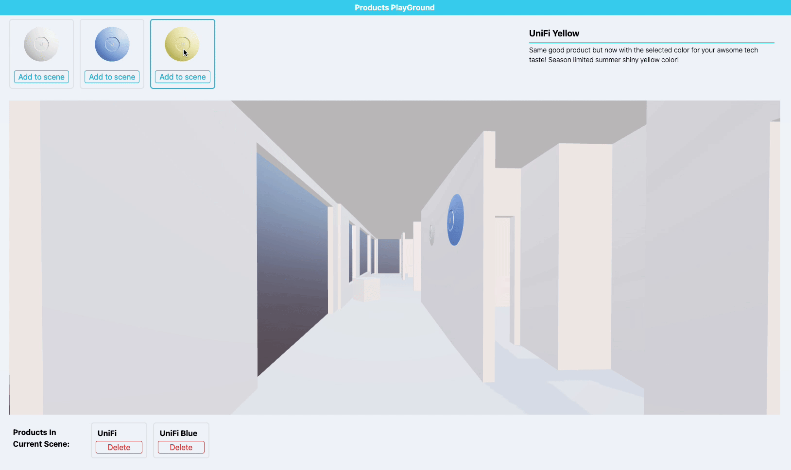
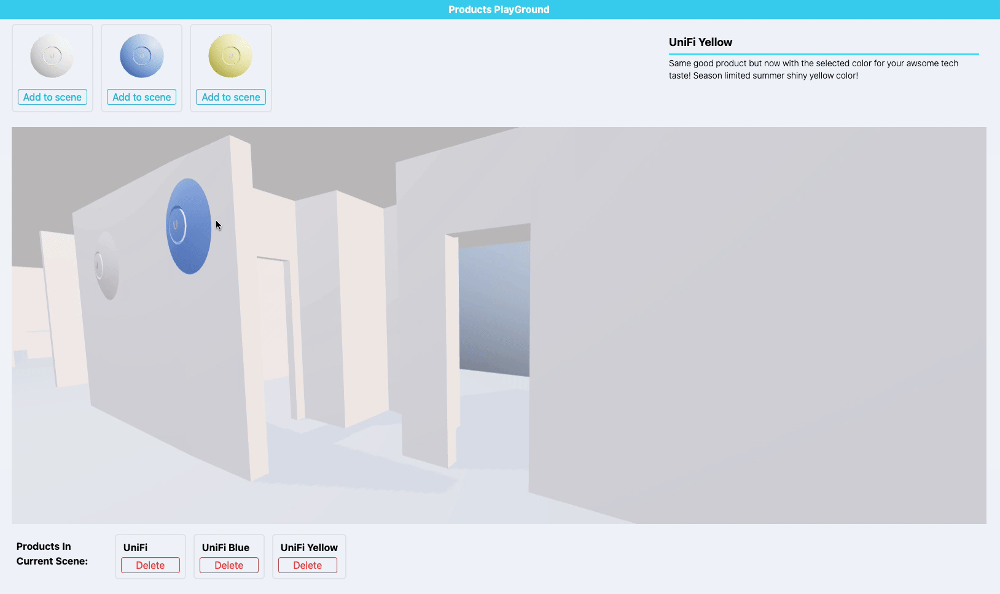
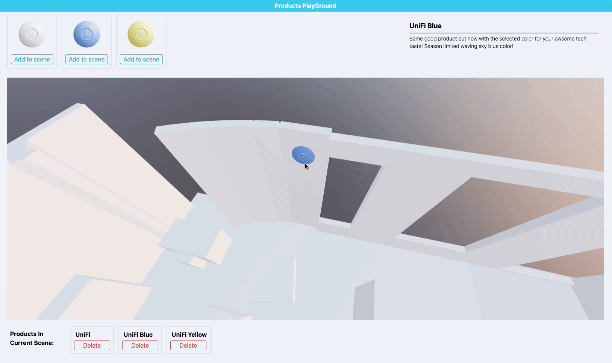
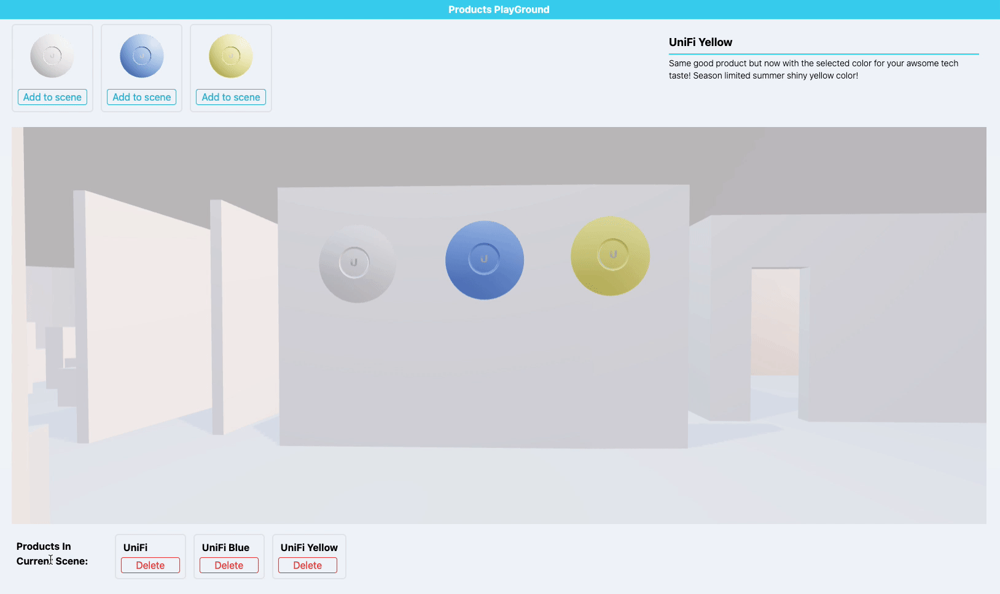
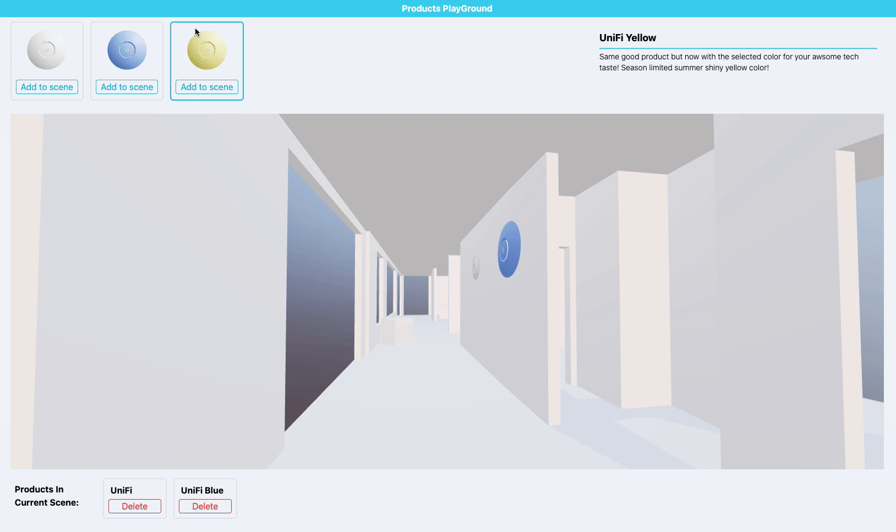

# Ubiquity Code Interview Project

This project was built for a code interview.

This repo is set to public for a limited time for Simon, Egils and their team to check my code.

## Project Guidence

Visit [https://threejs-ubi.vercel.app](https://threejs-ubi.vercel.app) for testing out deployed app.

For this app, you can:

### Add a product

By click the button of the sample product, you can add product to scene easily. Placable surfaces will be highligted before finsh placing.
I kept the size of product big for easier visulization.


### Move a product

Click a product in the scene to relocate it, product will follow the pointer until next mouse click.

If camera is higher than ceiling, the ceiling will be hidden for better relocating.


### Delete a product

All products in the scene are list below the canvas. Hover on a card will highlight the corresponding product in the scene, and then click Delete button to remove it from the scene.


### Samples are in 3D

You can check the sample products by the top menu bar.


## Code Explaining

### App Structure

```ts
<ProductProvider>
  <AppHeader />
  <div>
    <MenuBar />
    <MainScene />
    <CurrentProductsList />
  </div>
</ProductProvider>
```

### Process the model

I used `useGLTF` from `@react-three/drei` to load the floorPlan from `public` folder, in the Component `<Room />`.

There is no native loader in `three.js` for `.usdz` file of the product. I tried [this](https://www.npmjs.com/package/three-usdz-loader) package but it doesn't work well. So I processed the model in Blender and export it as `.gltf` file, so I can use the same loader.

I also exported two products with same geometry but different colour for the function that user can add different products.

### Set up canvas

Main `<Canvas />` is in component `<MainScene />`, you can find the lighting and environment setting there. I also set up "small" `<Canvas />` in component `<NewProductCard />` so user can have 3D previews of products.

### Add a product

`Add to scene` button in the component `<NewProductCard />` will:

1. Add a product to the global context `products`, then this product will be rendered out in the `<MainScene />`, which renders all the products based on context `products`.

2. Set global context `currentProductId` to this new product id, and set `isAttached` to `false`, so the product in the `<MainScene />` has `currentProductId` will update the location and quaternion (for rotation) along with where the pointer is, which is caculated by `raycaster`.

Once user find the proper place to put the product, another click on the walls (highlighted when placing the product, so user knows where is placable) will trigger `onClickHandle` in `<Room />`, which will set `isAttached` to `true`, leads the product stopping updating location and quaternion, and update the last location and quaternion to corresponding product in the context `products`.

### Move a product

When user click a product, `onProductClick` in the `<ProductUniFi />` will set `isAttached` to `false` and set `currentProductId` to current clicked product id, so start the placing process like descriped in the previous "Add a product" part.

### Delete a product

When user hover point on `<ProductInfoCard />`, which is the small product list below the canvas, `handleMouseEnter` will set context `isCheckingProduct` to `true` and `currentProductId` to id of current product, this will triggers the display of an transparent box in `<ProductUniFi />`.

When user click the `Delete` button `onDeleteHandle` in `<ProductUniFi />` will remove the currenet product from context `products`, which will remove the product from scene as well.

### Styling

I used `TailwindCSS` for simple styling.

### If you wish to run the code on your computer

Just clone the code, `npm i` and `npm start`.

## Things to do

### Highlighting Bug

When placing a product, it will only attached on walls, but somehow the furnitures are also highlighted. Function-wise this does not cause error (product will not attach on furnitures even though they are highlighted), but I should figure out why.

### Orgnizing the contexts

I have set many contexts in `productContext` during developing process, maybe some of them can be combined and cleaned. But due to limited time, I have no time to clean this part of the code.

### A Systematic solution to track user actions

I find that most function are highly relating to user interaction, including pointer postion and action, camera position and rotation. Should build a systematic solution to track user actions for achieving all kinds of functions in a better and clear way. My current function are archieved by global contexts and small handlers in each responding components.

### Quaternion

Should understand quaternion better for skilling up 3D development skill. Found [this](https://eater.net/quaternions/) good tutorial to share.
